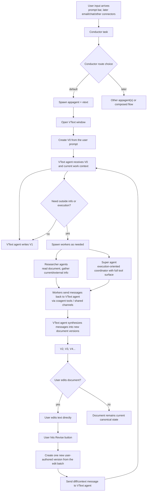

# Project Goals

**Last Updated:** 2026-04-16  
**Scope:** Canonical near-term implementation plan for local `vtext` + MAS completion, followed by embedded Dolt hardening and `vmctl` deepening.

---

## Core Goal

Make the local system coherent before doing more infrastructure work.

That means:
- the prompt bar always goes through `conductor`
- `conductor` becomes the real routing authority
- `vtext` becomes the primary user-facing work surface
- `vtext` versions become the canonical state of work
- generic work state stays simple and legible under a `dumb data, smart models` principle
- workers and `super` become visibly real and debuggable
- Trace becomes understandable enough to debug runs, then evolves into a real appagent
- prompts become easy to inspect and edit inside Choir as per-user sandbox state
- embedded Dolt becomes the real storage model
- only then do we go deeper on `vmctl` and microVM lifecycle

---

## First Deliverable: `vtext` Flow Chart

This is the target product/runtime flow.

### Important behavioral rules

1. The prompt bar input should call `conductor` no matter what.
2. If the result is “show a toast,” that should be `conductor`’s choice, not frontend pattern matching.
3. By default, `conductor` should spawn `appagent=vtext`.
4. Opening the `vtext` window should be a consequence of the conductor/appagent flow, not a deterministic desktop shortcut.
5. The user prompt becomes `v0`.
6. The `vtext` agent writes `v1`.
7. The `vtext` agent spawns workers when needed.
8. Workers never directly author canonical document text.
9. Workers read the document and send messages back to the `vtext` agent.
10. User edits are batched into one user-authored version when the user hits Revise.

---

## What Must Be True About The Product

### `vtext`

`vtext` is not chat.

`vtext` is:
- a version-native document surface
- the primary cumulative state of a project/process
- the place where user edits and agent synthesis meet
- eventually transclusion-native, not just text-native

`vtext` should feel like:
- one big editable document surface
- no sidebar-first UX
- no wasted chrome
- minimal floating controls only
- a natural place for users to steer and refine work

`vtext` should also:
- live canonically in embedded Dolt
- have a natural file manifestation or shortcut in the filesystem
- open from the file browser into a new `vtext` window even when the source of truth is the database

### Conductor

`conductor` is:
- the intake/router
- the place where prompt-bar input lands first
- later the place where connector input lands first

`conductor` should:
- always receive top-level input
- choose toast vs appagent routing
- default to spawning `vtext`
- later route to or compose other appagents

### Multiagent Runtime

The MAS should feel real, not implied.

That means:
- `vtext` should actually spawn researchers for current/external information
- `super` should actually appear for execution-oriented work
- messages between `vtext`, `researcher`, and `super` should be visible in Trace
- the system should not merely “hint” at delegation in prompts while behaving like a single-shot rewrite

### Data Modeling

We should follow a `dumb data, smart models` principle.

That means:
- keep stored work data generic and inspectable
- preserve actors, timestamps, messages, versions, and causal relationships
- preserve whether work happened sequentially or concurrently
- avoid over-encoding workflow algorithms into specialized schema prematurely
- let models interpret and process the data, with policy expressed in prompts

In practice:
- do not feel obliged to build tables like `work_edges` just because the relationships are graph-like
- do preserve enough information to reconstruct what caused what
- treat runtime execution records as implementation details around a broader concept of work

---

## Proximate Next Tasks

These are the real next tasks, in order.

### 1. Make `conductor` authoritative

- Remove deterministic prompt-bar dispatch in the frontend.
- The prompt bar should always submit to `conductor`.
- If the user gets a toast, that should be because `conductor` chose that outcome.
- Default route should be: spawn `appagent=vtext`.
- Opening `vtext` should happen from conductor output, not from a frontend shortcut.

### 2. Make `vtext` UX coherent

- The `vtext` window should be almost entirely the document surface.
- Keep only:
  - floating Revise button
  - floating `<` and `>` version navigation
  - extremely minimal status signaling
- Remove dead space and misleading status chrome.
- Make version navigation clear and safe.

### 3. Make the `vtext` process real

- The user prompt should create `v0`.
- The `vtext` agent should write `v1`.
- The `vtext` agent should spawn workers as needed.
- Worker messages should cause new canonical versions.
- User edit batches should create one user-authored version and produce a diff/context message for `vtext`.
- This should work naturally as an iterative document loop, not like chat turns.

### 4. Make worker spawning visible and trustworthy

- `researcher` should appear for current/external-info requests.
- `super` should appear for execution-oriented work.
- Both should be able to message `vtext` and each other through coagent tools.
- The user should be able to tell whether delegation actually happened.

### 5. Delete the fake polling `Super`

- Remove the current polling health-checker named `Super`.
- Do not keep papering over the naming conflict.
- Rebuild `super` the right way as a real agent role in the MAS rather than a ticker-driven runtime monitor.
- If we still need runtime health monitoring, give it a narrow and honestly named implementation later.

### 6. Improve Trace

- Make Trace readable enough to debug runs quickly.
- Show:
  - top-level run
  - delegation chain
  - worker/task family
  - tool calls
  - message flow
  - canonical synthesis points
- Prefer “simple and legible” over “maximally complete.”
- Learn from the old Rust Trace app, but do not duplicate its complexity.
- Bias toward visual explanation:
  - geometry
  - topology
  - temporality
  - color
- Avoid requiring the user to read every message just to understand what happened.
- Make it easy to query, filter, and inspect runs agentically.
- After we find the right visualization, Trace should become a real appagent rather than just a passive debug surface.

### 7. Add prompt management

- Prompts should be easy to inspect and edit inside Choir.
- Prompt configuration is a per-user concern and should live inside the sandbox.
- Users should be able to manage:
  - conductor prompting
  - `vtext` prompting
  - worker-role prompting
- later, app-specific prompts and policies
- Prompt management should become an app in the desktop, but it should rely on the same per-user sandbox state model as the rest of the system.

### 8. Stabilize embedded Dolt

- Embedded Dolt should be the real sandbox storage model.
- `vtext` versions should feel native to that model.
- Work/version state should be aligned with the document-centered product.
- `vtext` should have a filesystem manifestation or shortcut model that makes sense in the file browser.
- Keep host-side SQLite where it makes sense, but stop treating SQLite as the sandbox document truth.

### 9. Then return to `vmctl`

- Review `go-choir` `vmctl` + `vmmanager` + `microvm.nix`.
- Review `choiros-rs` user-VM / worker-VM lifecycle patterns.
- Learn from the good parts while rejecting the “hibernate too aggressively” behavior.
- Design the right user-VM / worker-VM lifecycle for fast login, bounded cost, and sensible hibernation.

---

## Technical Debt To Track Explicitly

### Product / Runtime Debt

- The prompt surfaces are scattered across frontend/backend/runtime.
- There is no coherent per-user prompt-management surface yet.
- The frontend still contains routing behavior that should belong to `conductor`.
- Trace is still too raw and too hard to read.
- `vtext` orchestration is too prompt-fragile.
- The system can delegate in principle, but the product does not yet make that trustworthy.
- The current runtime vocabulary still overweights `task` records relative to the broader concept of work.
- The fake polling `Super` muddies the intended `super` role.

### Naming / Conceptual Debt

- Old names still leak into code, docs, and habits.
- Prior concepts from `etext`, `writer`, `terminal agent`, and `supervisor` can still confuse implementation decisions.
- We need a canonical glossary and should use it consistently.

### Documentation Debt

- Some docs are still aspirational rather than descriptive.
- Some docs still assume Cogent as an external control plane.
- Some docs still contain Factory-era assumptions and references.
- README and state docs need continued maintenance as the implementation moves.

### Factory / Workflow Debt

- `.factory` bootstrap assumptions still exist.
- Mission artifacts and old references still point to Factory-era workflows.
- We should remove Factory Droid residue instead of letting it quietly shape local development.

### Infrastructure Debt

- `vmctl` is still not deeply validated on real x86 Firecracker hosts.
- The browser app is still constrained by the current iframe approach.
- The local dev/test stack is still too easy to get into a half-working state.

---

## Deliverables Before Codegen / CI Iteration

Before the next big implementation + test + CI pass, we want these docs to be the source of truth:

1. This goals file
2. The canonical glossary
3. The `vtext` flow chart above

Once these are confirmed:
- do codegen / implementation
- test locally
- push
- iterate on CI until green

---

## Simple Definition Of Success

We are on track when:
- the prompt bar always goes through `conductor`
- `conductor` really chooses what happens
- `vtext` feels like the document itself
- `vtext` actually spawns workers when appropriate
- Trace makes it obvious what happened without requiring message-by-message reading
- prompts are editable as per-user sandbox state inside Choir
- embedded Dolt is the real local storage model
- and only after that, `vmctl` becomes the main next frontier
